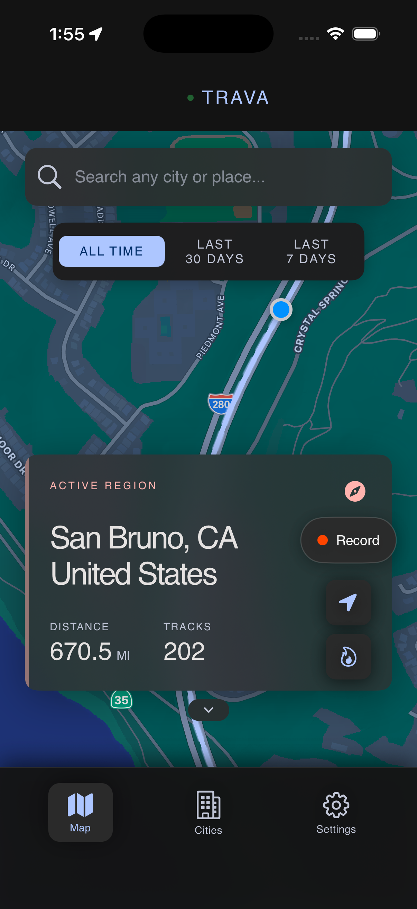
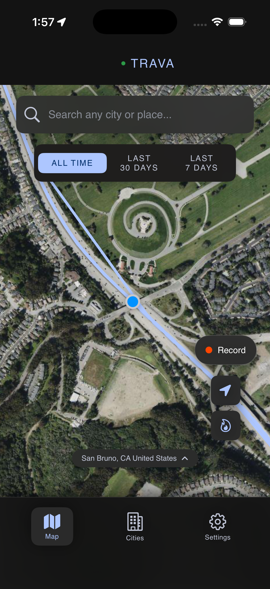
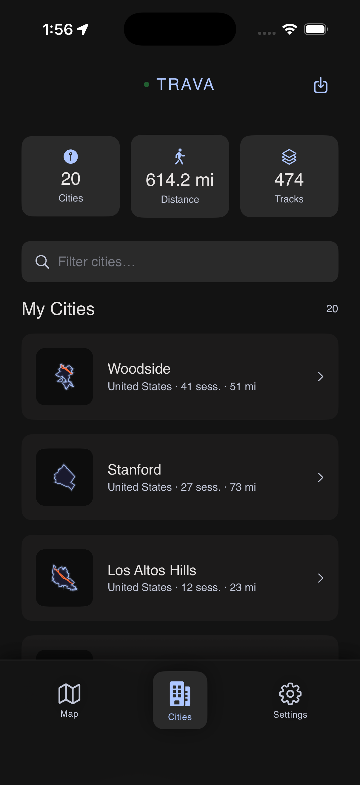
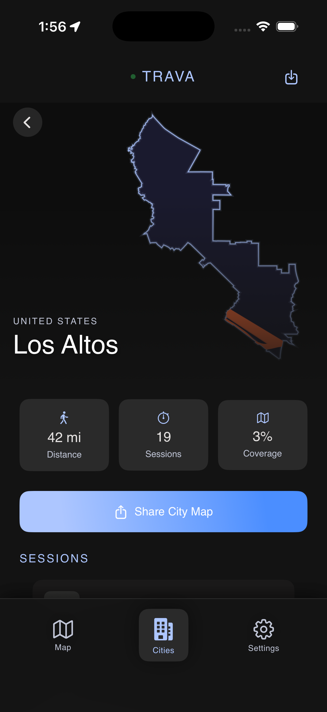
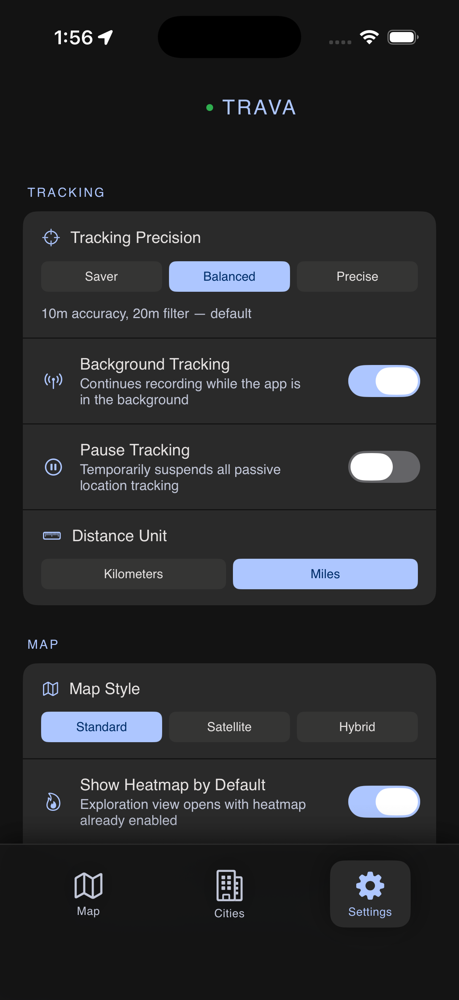
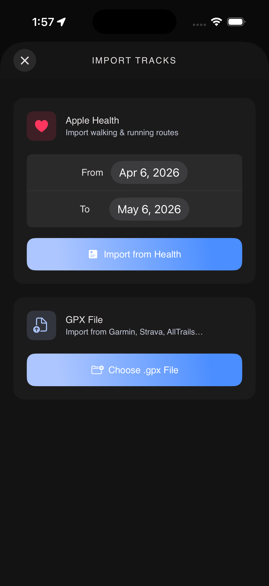

# Trava

Trava is an iOS app that tracks everywhere you walk and turns your movement into a living map. Every street you cover gets recorded — building a personal record of your exploration city by city. Unlike fitness apps that focus on pace and calories, Trava focuses on *coverage*: how much of a city have you actually seen?

---

## Features

### Tracking
- **Passive GPS tracking** — runs silently in the background using always-on location; no buttons to press
- **Focused session recording** — tap Record to switch to high-precision mode for deliberate walks or runs
- **Configurable precision levels** — Battery Saver (100m, 50m filter), Balanced (10m, 20m filter), or Precise (best accuracy, 5m filter)

### Visualization
- **Custom heatmap renderer** — a CoreGraphics overlay that blends visit-count data into a color gradient directly on the MapKit canvas, with no third-party library
- **City boundary silhouettes** — crisp city outlines fetched from OpenStreetMap and rendered as shareable cards
- **Coverage tracking** — a grid-cell algorithm that measures what percentage of a city's area you've actually walked

### Data
- **Offline-first architecture** — all tracks and city data are persisted in CoreData; the app works fully without a network connection
- **Firebase cloud sync** — Firestore backs up and syncs data across devices when signed in
- **Flexible import** — bring in past routes from Apple Health workouts or any GPX file (Strava, Garmin, AllTrails, Komoot)

### Control
- **Granular tracking settings** — adjust GPS precision, toggle background mode, and pause all location updates independently
- **Guest mode** — the full app works without creating an account; data stays on-device only

---

## Screenshots

<table>
  <tr>
    <td align="center" width="33%">
      
        
      <b>Map & Active Region</b>
       
      The live map shows all recorded tracks as glowing paths. The active region card displays current city, total distance, and track count. The green dot in the nav bar confirms passive tracking is running.
    </td>
    <td align="center" width="33%">
      
        
      <b>Satellite View + Record</b>
       
      Switch between Standard, Satellite, and Hybrid map styles. The floating Record pill starts a high-precision focused session. Location and heatmap controls sit below it. Time filters let you view tracks from the last 7 days, 30 days, or all time.
    </td>
    <td align="center" width="33%">
      
        
      <b>Cities Dashboard</b>
       
      Every city you've visited appears automatically — no manual tagging. Each card shows a boundary silhouette thumbnail drawn from OpenStreetMap data, with session count and total distance. Global stats sit at the top.
    </td>
  </tr>
  <tr>
    <td align="center" width="33%">
      
        
      <b>City Detail</b>
       
      Full-screen city view with a large boundary silhouette, distance, session count, and coverage percentage. The Share button exports a polished snapshot card. All sessions for that city are listed below.
    </td>
    <td align="center" width="33%">
      
        
      <b>Tracking Settings</b>
       
      Three GPS precision tiers (Saver / Balanced / Precise), a background tracking toggle, and a pause switch that suspends all location updates without losing your session. Distance unit switches between km and miles globally.
    </td>
    <td align="center" width="33%">
      
        
      <b>Import Tracks</b>
       
      Pull in Apple Health walking and running workouts by date range, or import any .gpx file from Garmin, Strava, AllTrails, Komoot, or similar. Imported tracks are processed through the same city-detection and coverage pipeline as live recordings.
    </td>
  </tr>
</table>

---

## Tech Stack

| Layer | Technologies |
|---|---|
| Language & UI | Swift, SwiftUI |
| Maps | MapKit, CoreLocation |
| Persistence | CoreData, Firebase Firestore |
| Auth | Firebase Auth |
| Health | HealthKit |
| Geocoding | OpenStreetMap / Nominatim |

---

## Architecture

**Offline-first data layer.** CoreData is the single source of truth for all tracks and city records. Firestore acts as a sync layer, not a primary store — writes go to CoreData first and propagate to the cloud in the background. This means the app is fully functional with no internet connection, and there is no loading state on first launch.

**Dual tracking modes with clean handoff.** The app runs two distinct GPS configurations. Passive mode uses `kCLLocationAccuracyNearestTenMeters` with a 20-meter distance filter, background location updates, and automatic pause detection — optimized to run indefinitely with minimal battery impact. When the user starts a focused session, the manager closes the current passive track, reconfigures to `kCLLocationAccuracyBest` with an 8-meter filter, and disables automatic pausing. On stop, the inverse handoff restores passive settings and resumes the background accumulator.

**Custom heatmap rendering.** The heatmap is a native `MKOverlayRenderer` subclass that draws directly into a CoreGraphics context. GPS points are binned into a grid, normalized by visit count, and painted using a hand-tuned color ramp from cool blue through orange to white. Rendering runs on the map's tile draw cycle with no off-screen buffers or external dependencies.

**Multi-city track splitting.** A single GPS session can pass through multiple cities. When saving a track, the service samples coordinates against the bounding polygons of candidate cities and splits the track at boundary crossings, attributing each segment to the correct city. This lets a commute or road trip populate multiple city cards from a single recording.

**Grid-cell coverage algorithm.** City coverage is calculated by dividing the city's bounding box into a uniform grid of approximately 50-meter cells. Each cell that contains at least one recorded GPS point within the city polygon is marked visited. Coverage is the ratio of visited cells to total cells that fall inside the polygon. This approach is stable against GPS density variations and scales correctly across cities of any size.

---

## Why I Built This

I wanted a way to track the places I actually visit on foot — not workouts, but exploration. Every fitness app I tried was optimized for segments and pace; none of them told me anything about *where* I'd been relative to where I could go. I also wanted a project that would touch the full iOS stack: real-time location, custom rendering, offline persistence, cloud sync, and health data — things that rarely appear together in sample code.

Trava is the result of that itch. It's a product I use daily and a codebase I care about keeping clean. The technical constraints — battery-efficient always-on tracking, GPS noise rejection, multi-city attribution — turned out to be genuinely interesting engineering problems, and solving them properly was the point.

---

## Roadmap

- Neighborhood-level granularity within cities
- Social layer — friends, shared exploration maps
- Exploration challenges and personal goals
- Web dashboard for larger-screen viewing
- Pro tier with extended history and export options

---

## License

Licensed under MIT — see the [LICENSE](LICENSE) file.
